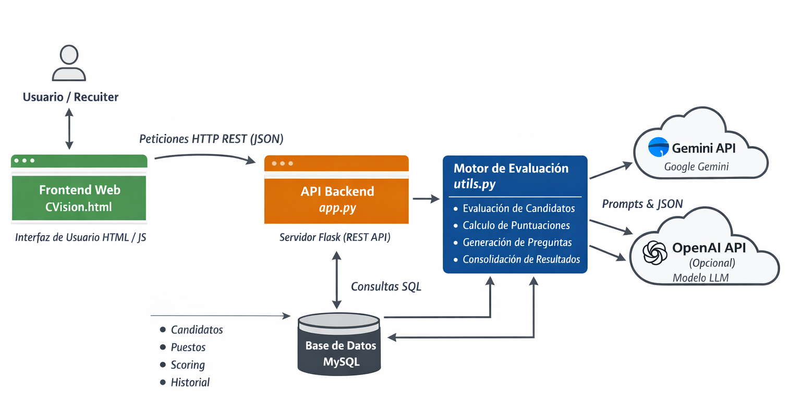

# CVision – AI-powered Candidate Evaluation Platform

CVision es una aplicación web **full-stack** diseñada para asistir en procesos de selección mediante **evaluación automatizada de candidatos con modelos de lenguaje (LLMs)**.  
El sistema combina criterios técnicos, de RRHH y de negocio de forma estructurada, explicable y auditable.

El objetivo no es sustituir al recruiter, sino **reducir el trabajo manual y repetitivo**, mejorar la consistencia de las evaluaciones y generar información accionable (scoring, justificaciones y preguntas de entrevista).

---

## 🎯 Problema que resuelve

En muchos procesos de selección:

- La revisión de CVs es manual y poco escalable  
- Los criterios de evaluación varían entre evaluadores  
- Es difícil justificar por qué un candidato obtiene cierta puntuación  
- Se invierte mucho tiempo en generar preguntas de entrevista personalizadas  

CVision aborda este problema mediante un **motor de evaluación asistido por IA**, manteniendo siempre el control humano sobre las decisiones finales.

---

## 🧠 Enfoque y principios de diseño

El proyecto está diseñado con criterios **enterprise y de IA responsable**:

- La IA **asiste**, no toma decisiones finales  
- Todas las evaluaciones incluyen **justificaciones explícitas**  
- Separación clara de responsabilidades:
  - Frontend
  - API
  - Lógica de negocio
  - Persistencia
  - Integración con LLMs
- Uso de prompts estructurados y respuestas en JSON
- Preparado para evolucionar hacia arquitecturas multiagente

---

## 🏗️ Arquitectura de la solución

La aplicación sigue una arquitectura por capas claramente definida:

### 1. Frontend Web
- HTML, CSS y JavaScript
- Interfaz ligera tipo SPA
- Gestión de puestos y candidatos
- Visualización de rankings y resultados
- Exportación de informes a PDF

**Archivo principal**
- `CVision.html`

---

### 2. Backend – API REST
- Implementado en **Flask**
- Expone endpoints REST consumidos por el frontend
- Orquesta el flujo completo de evaluación

**Archivo principal**
- `app.py`

---

### 3. Motor de Evaluación (Core)
- Lógica central del sistema
- Evaluación concurrente de candidatos
- Simulación de distintos perfiles evaluadores (técnico, RRHH, manager)
- Normalización y consolidación de puntuaciones
- Generación de:
  - Scoring final
  - Justificaciones detalladas
  - Preguntas de entrevista personalizadas

**Archivo principal**
- `utils.py`

---

### 4. Capa de Inteligencia Artificial
- Integración con modelos LLM:
  - Google Gemini
  - OpenAI (opcional)
- Prompts altamente estructurados
- Respuestas forzadas en JSON para robustez y trazabilidad
- Uso de la IA como **motor de análisis**, no como caja negra creativa

---

### 5. Persistencia de Datos
- Base de datos MySQL
- Almacenamiento de:
  - Candidatos
  - Puestos
  - Evaluaciones
  - Puntuaciones históricas
- Permite trazabilidad, auditoría y re-evaluación

---

## 📐 Diagrama de arquitectura


---

## ⚙️ Tecnologías utilizadas

- **Backend:** Python, Flask  
- **Frontend:** HTML, CSS, JavaScript  
- **Base de datos:** MySQL  
- **IA / LLMs:** Google Gemini, OpenAI  
- **Otros:** AsyncIO, REST APIs, JSON, TailwindCSS  

---

## 🚀 Ejecución local

1. Instalar dependencias:
```bash
pip install -r requirements.txt
